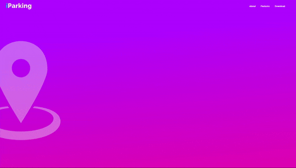
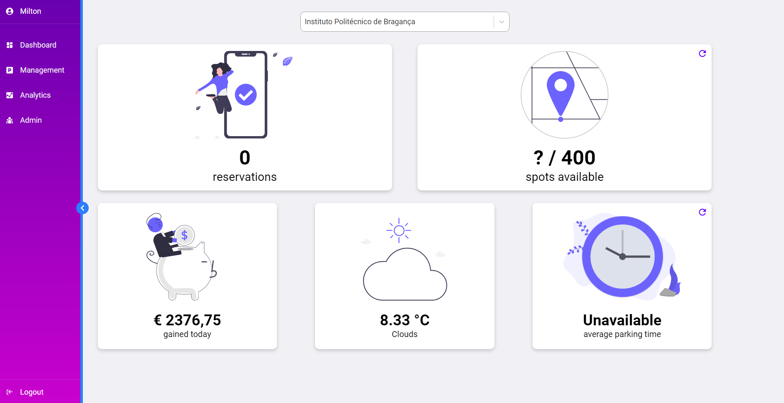

<!-- PROJECT LOGO -->
 

  

  <h3 align="center">iParking Web</h3>

  

    A web system for marketing and management of the Smart Parkings!
  

<!-- ABOUT THE PROJECT -->
## About The Project

A web application for users who want to know more about the iParking mobile app and a management platform for admins who want to see statistics, logs and create new parking spots.

## Sections

### Marketing

* Home
* About the App
* Features
* Download

  

### Management
* Login
* Dashboard
* Management of parkings, regions and spots.
* Analytics
* Add admins and request device keys.

  

## Built With

* [React](https://reactjs.org)
* [Redux](https://react-redux.js.org)
* [Firebase](https://firebase.google.com)
* [HTML](https://www.w3schools.com/html/html_intro.asp)
* [CSS](https://www.w3schools.com/css/css_intro.asp)
* [CSS Animations](https://www.w3schools.com/css/css3_animations.asp)
* [Figma](https://www.figma.com/file/k3uKcueQoDuStP2xQpNNPk/iParking-Web?node-id=0%3A1)

<!-- CONTACT -->
## Contact

Milton Boos Junior - miltonboosj@gmail.com

Project Link: [https://github.com/juniorboos/iParking-Management](https://github.com/juniorboos/iParking-Management)

